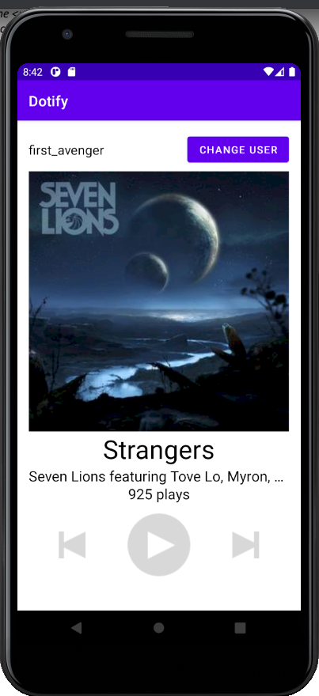

# Homework 1: Layouts and Events

## Brandon Ta

### Description

Created an app called Dotify that is a basic Cloud music player. The app currently a proof of concept screen and cannot play music yet. Users can change their username and click on the media buttons. The skip and previous buttons show toast message while the play button increments the number of plays by 1. Users can also long click the cover art to change the color of the number of plays text

### Attempted Extra Credit

- Users cannot click apply to change their username if the edit text field is empty
- Long pressing the cover art alternates the text color of the play count between purple and the default black
- There is a guideline between the media buttons and the play count text
- All hardcoded dimensions and colors are extracted into their respective res files
- There is another xml file that uses Linear Layout in the res/layout folder called `activity_main_linear_layout.xml` whereas the `activity_main.xml` is the default one that uses Constraint Layout

### Screenshot

