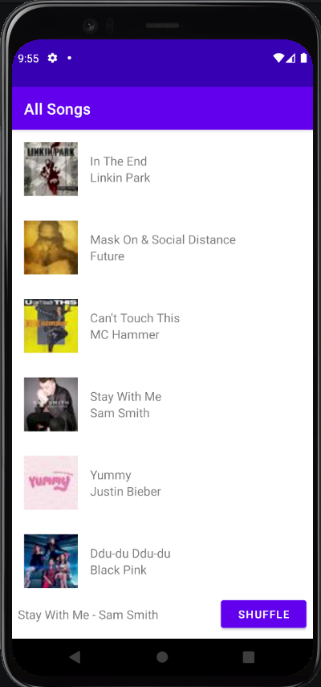

# Homework 2: RecyclerView and Multiple Activities

## Brandon Ta

### Description

Expanded on Dotify by adding a list of songs layout and activity. Users can click on songs to "play it", displaying
the song on a mini player at the bottom of the screen. Additionally, users can shuffle the list of songs, long click
on a song to delete it, and click on the mini player to transition to the player activity from HW1.

### Attempted Extra Credit

- There is a stock Android up button at the top left that will bring users back to the list of songs activity
from the player activity.
- Long clicking on a song will delete and show a Toast detailing what song was deleted.
- The shuffle and delete animations are animated using DiffUtil.

### Screenshot

