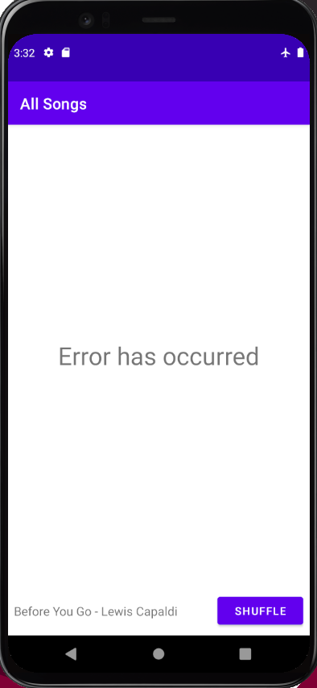
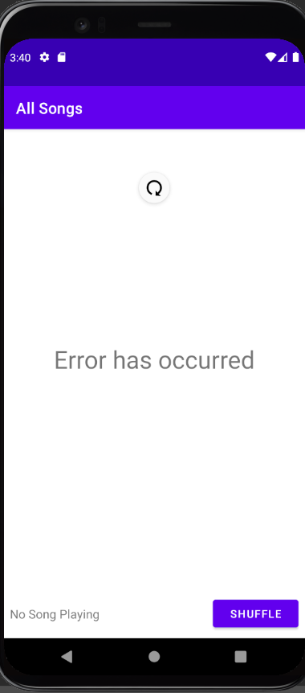
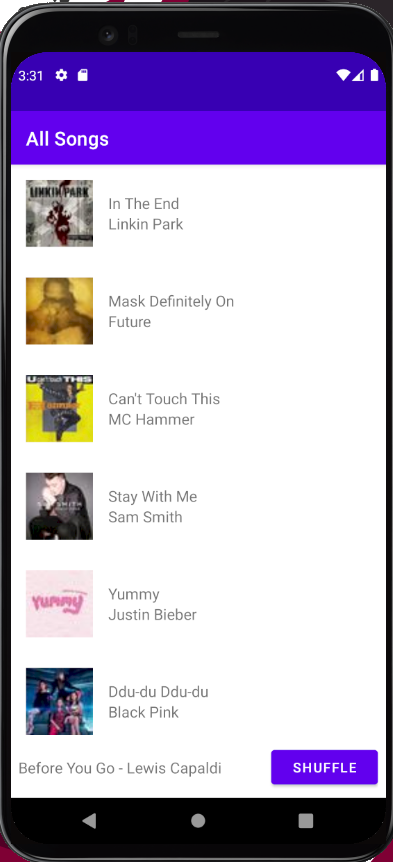

# Homework 4: Application, JSON parsing, HTTP REST calls

## Brandon Ta

### Description

Organized the Dotify project codebase by creating an application object that handles some of the app's functionality and information through managers. Getting the list of songs is also done through an HTTP request. Also added a swipe to refresh feature to the list of songs screen. An error message is shown if there is an error getting the list of songs.

### Attempted Extra Credit

- Users can swipe to refresh the list of songs.
- The recycler view is hidden and an error msg is shown if an error occurs.
- Refreshing will hide the error msg, show the recycler view, and refresh the list of songs.

### Screenshots

