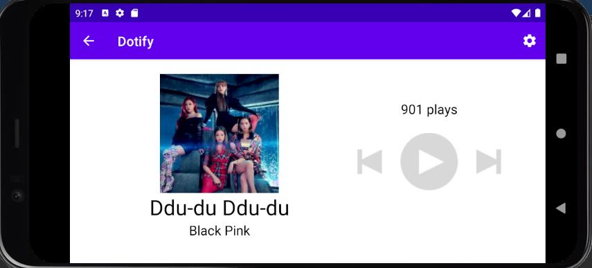
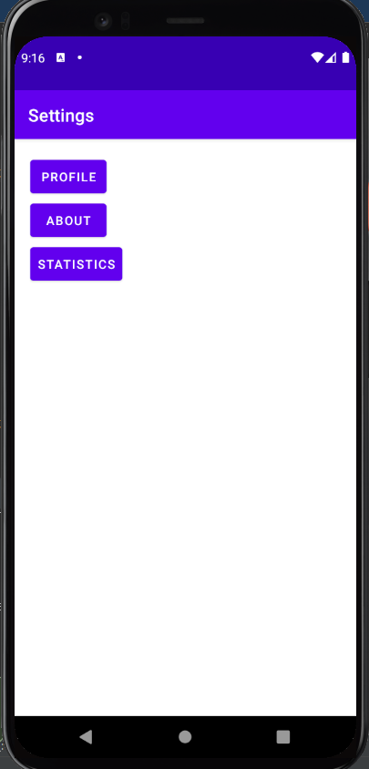
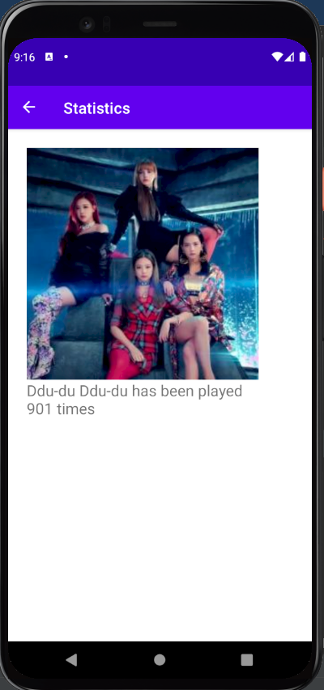

# Homework 3: Fragments, Activity Lifecycle, & Rotation

## Brandon Ta

### Description

Expanded on Dotify by adding a settings button on the top right of the Player. This leads to a settings page that has buttons to additional pages. These pages include an about page, a profile page, and a statistics page. The statistics page displays the cover of the current song as well as its play count.

### Attempted Extra Credit

- There is a button at the top left of each fragment other than the home settings fragment that brings users back to the previous fragment.
- The settings button on the Player is an action button located on the top header bar.

### Screenshots

