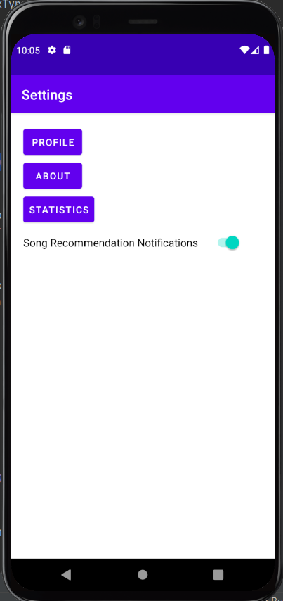
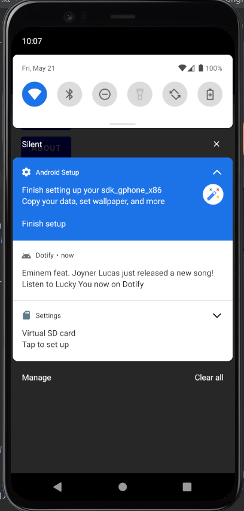
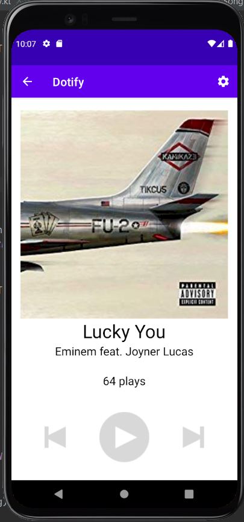

# Homework 5: WorkManager & Notifications

## Brandon Ta

### Description

Added a new feature that allows users to get periodic notifications of new song releases. This feature is controlled with a switch and persists through destroying the app. The notifications can be clicked on to launch the player screen that displays the song mentioned in the notification.

### Attempted Extra Credit

- Tapping the notification passes its contained song to the PlayerActivity and launches it with said song

- In `SongRecommendationManager.kt` there is a function called `songRecommendationPeriodicallyExtraCredit()` that has the same functionality of sending users periodic notifications of new song releases but does so every two days and when the device is connected to a network and the device's battery is not low.

### Screenshots

